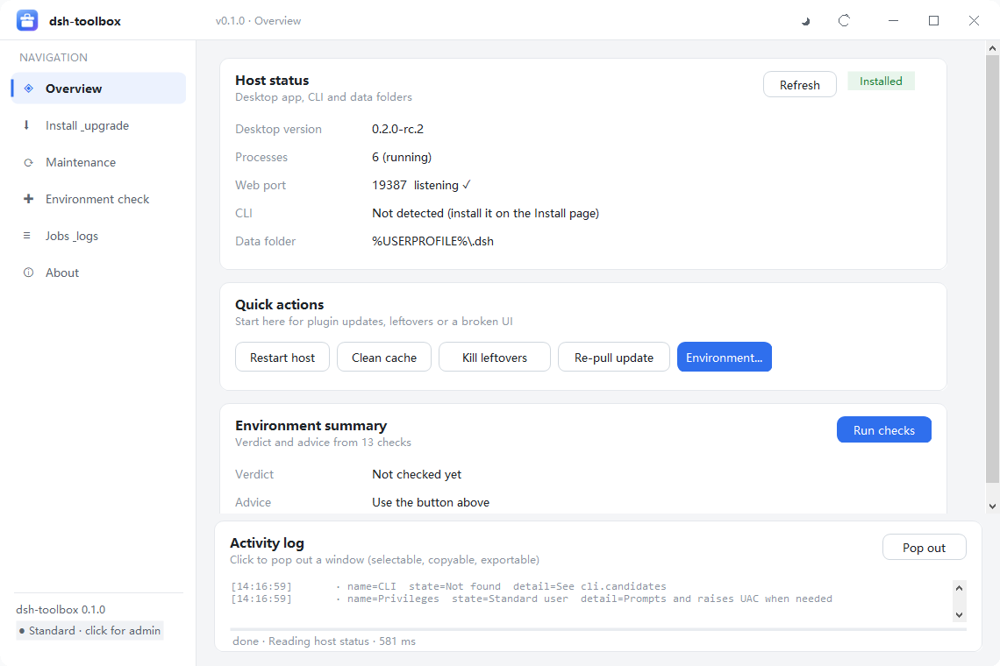
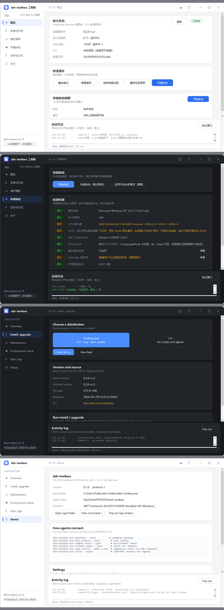
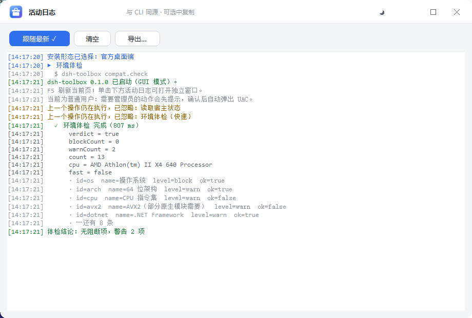

# dsh-toolbox —— DSH 工具箱

[English](README.md) | **简体中文**

[](https://github.com/w32394045-dotcom/dsh-toolbox/actions/workflows/build.yml)
[](LICENSE)


一个**单文件 Windows exe**，给 DSH agent 当"手和脚"：文件扫描、哈希、进程与服务、系统与网络诊断、
签名与完整性校验、后台任务与日志管理 —— 并且都能被 agent 以稳定 JSON 契约驱动。

* 产物：`dsh-toolbox.exe`（约 490 KB，**只依赖系统自带的 .NET Framework 4.8**）
* 无 Python / Node / .NET SDK / 管理员权限依赖；启动零延迟（适合被频繁调用）
* 机器可读优先：`--json` 一个信封、`--jsonl` 流式、严格退出码、永不静默成功
* 长连接通道：`serve --stdio`（NDJSON 上的 JSON-RPC 2.0），可订阅日志与任务事件
* 验收：`verify.ps1` **36 项全绿**（信封 / 退出码 / stdout 纯净性 / 结论语义 / 破坏性闸门 / 流式契约 / 通道）
* **GUI + CLI 同一个 exe**：双击进图形界面，带参数走 CLI



## 为什么会有这个东西

起因是一次真实的故障排查：DSH 桌面端自动升级失败，报
`Command failed: set "PSModulePath=" & chcp 65001 >NUL & powershell.exe ... Get-AuthenticodeSignature ...`。
查下来是 electron-updater 6.8.9 把 PowerShell 签名校验**硬编码成 20 秒超时**，而这台机器
（机械硬盘 + Defender）实测需要 32~45 秒 —— 超时被 SIGTERM，错误被当成"签名无效"。

结论很直接：**很多系统级能力，agent 手里缺一个可靠、可编程、会说 JSON 的工具**。
于是有了这个工具箱，`sign.verify` 就是它的第一块招牌命令（不设超时、回报耗时毫秒）。

## 功能

* **66 条命令 / 20 组** —— 见下方命令表
* **两种安装形态**：官方桌面端或 CLI（`@deepseek-ai/dsh`），内置安装器含大小 + SHA-512 + Authenticode 校验、
  静默安装、版本校验、启动
* **环境体检**（`compat.check`）：13 项针对已知故障场景 —— 验签超时、CPU 指令集缺失、PowerShell 受限、
  超长路径、Defender 排除项、磁盘空间、TLS、VC++ 运行库
* **宿主运维**（`host.status` / `maint.*`）：重启宿主刷新插件、清理缓存、结束残留进程、重新拉取更新、
  重建工具箱自身
* **浅色 / 深色主题** + **中文 / English 界面**，两者默认都跟随系统
* **按需提权**：点侧栏用户标签 → 说明框 → UAC → 重启为管理员实例
* **长任务实时进度**（安装 / 升级 / 重新拉取）走 `--jsonl` 流式帧
* **活动日志**可弹出独立窗口，可选中、可导出、实时同步
* **脱敏模式**（`DSH_TOOLBOX_REDACT=1`）：界面隐藏用户名与主目录路径，截图和日志可以放心贴到 issue 里，
  CLI 契约完全不受影响

## 下载

从 [**Releases**](https://github.com/w32394045-dotcom/dsh-toolbox/releases/latest) 直接拿预编译的 exe ——
不用安装、不用装运行时，双击就能用。

## 快速开始

```powershell
$exe = '.\dsh-toolbox.exe'

& $exe                             # 无参数 → 图形界面（双击同理）
& $exe help                        # 命令总览
& $exe manifest --json             # 机器可读清单（agent 自发现用）
& $exe doctor --json               # 环境自检
& $exe host.status --json          # 桌面端 / CLI / Web 端口 / 权限
& $exe compat.check --json         # 13 项环境体检
& $exe install.check --json        # 官方源最新版本 / 大小 / SHA-512
& $exe scan.find --path . --ext .cs --newer 7d
& $exe proc.list --sort mem --top 15
& $exe sign.verify --path C:\Windows\System32\notepad.exe --json
& $exe serve --stdio               # agent 长连接用的 JSON-RPC 通道
```

详细接入方式（JSON 契约、退出码、日志与任务目录、serve 协议、安全约定）见
[docs/AGENT-GUIDE.md](docs/AGENT-GUIDE.md)；完整命令清单由 `manifest --json` 自动生成：[docs/COMMANDS.md](docs/COMMANDS.md)。

## 图形界面



* 6 个页面：概览 / 安装与升级 / 维护刷新 / 环境体检 / 任务与日志 / 关于
* **与 CLI 共用同一套实现** —— 界面通过子进程调自己的 CLI，所以"界面里能用"就等于"通道里能用"
* 无边框自绘 WinForms，DPI 自适应、圆角、`TextRenderer` 保证中文渲染正确
* 单击活动日志弹出同风格独立窗口：



## 命令总览

| 组 | 命令 |
|---|---|
| 核心 | `doctor` `sysinfo` `env` `manifest` `version` `help` |
| 文件扫描 | `scan.find` `scan.size` `scan.tree` `scan.dup` `scan.snapshot` `scan.verify` `scan.recent` `scan.empty-dirs` |
| 哈希 | `hash.file` `hash.dir` `hash.compare` |
| 进程 | `proc.list` `proc.tree` `proc.find` `proc.kill` `proc.wait` `proc.port` |
| 服务与系统 | `svc.list` `svc.control` `disk.space` `disk.health` `eventlog.list` `eventlog.query` `installed.list` `defender.status` `startup.list` |
| 网络 | `net.ports` `net.tcp` `net.http` `net.dns` `net.ip` `net.download` |
| 签名与完整性 | `sign.verify` `sign.chain` `sign.hash` `sign.motw` |
| 任务与日志 | `run` `job.start` `job.list` `job.status` `job.output` `job.kill` `log.append` `log.tail` `log.search` `log.runs` |
| 宿主与维护 | `host.status` `maint.restart-host` `maint.kill-leftovers` `maint.clean-cache` `maint.pull-update` `maint.rebuild-self` |
| 环境与安装 | `compat.check` `compat.fix` `install.check` `install.desktop` `install.cli` `install.verify` `elevate.run` |
| 设置 | `config.get` `config.set` |
| 通道 | `serve --stdio`（JSON-RPC 2.0） |

以上全部已实现，并通过真实调用验证（36 项验收全绿）。

## 构建

```powershell
powershell -File tools\fetch-roslyn.ps1    # 下载 Roslyn（首次需要，约 40 MB，来自 NuGet）
powershell -File build.ps1                 # → dist\dsh-toolbox.exe
powershell -File verify.ps1                # 对构建产物跑 36 项验收
powershell -File build.ps1 -Out mine.exe   # 并行开发时各用各的输出名
```

编译器是 **Roslyn 4.14**（取到 `.tools\` 下），目标运行时是系统自带的 **.NET Framework 4.8** ——
所以 exe 很小、不需要装任何 SDK，也不会往系统里写东西。

CI（`.github/workflows/build.yml`）每次推送都会在干净的 `windows-latest` 上做同样的事：
取 Roslyn → 构建 → 跑 36 项验收 → 把 exe 作为 artifact 上传。

## 架构一页

```
src\Program.cs            入口：全局选项、命令解析、超时、运行记录、错误兜底、help
src\Core\Json.cs          零依赖 JSON（保序写出 + 复用系统解析器）
src\Core\Cli.cs           选项解析（--k v / --k=v / -k v，可重复累加，不做逗号分割）
src\Core\Runtime.cs       Ctx / Output(信封) / Log(JSONL) / Paths / Registry / ExitCodes / ToolException
src\Core\Fs.cs            glob→regex、安全遍历、大小与时长解析、哈希、并行映射
src\Core\L10n.cs          设置 + 双语取值（L.T("中文","English")）
src\Commands\*.cs         各命令模块，每个模块一个 Register()
src\Gui\*.cs              WinForms 界面：主窗体、自绘控件、Bridge、日志窗口、脱敏
```

契约是**冻结**的：`docs/CLI-CONTRACT.md`（对外承诺）与 `docs/ARCHITECTURE.md`（内部约定），
两者是实现与并行开发的唯一依据。

## 设置

```
%LOCALAPPDATA%\dsh-toolbox\settings.json   { "lang": "auto", "theme": "auto" }
```

默认都是 `auto` —— **语言跟随 Windows 显示语言，主题跟随 Windows 应用模式**。
优先级：`--lang` / `--theme` > `DSH_TOOLBOX_LANG` > `settings.json` > 系统。

```powershell
& $exe config.get --json                     # 设置值 / 系统检测值 / 路径
& $exe config.set --lang en-US --json
& $exe config.set --theme dark --json
& $exe config.set --lang auto --json         # 回到跟随系统
```

## 运行时数据

```
%LOCALAPPDATA%\dsh-toolbox\
  settings.json                 语言 / 主题
  logs\toolbox-YYYYMMDD.jsonl   结构化日志
  runs\runs.jsonl               每次调用记录（cmd/argv/exit/ms/cwd/pid）
  runs\<runid>.out.json         大结果落盘
  jobs\<jobid>\                 后台任务（cmd.json / stdout.log / stderr.log / status.json）
```

可用 `--home <dir>` 或环境变量 `DSH_TOOLBOX_HOME` 覆盖。

## 安全约定

* 破坏性操作默认拒绝执行（退出码 2）：先 `--dry-run` 预览，确认后 `--yes`。
* `--dry-run` 保证零副作用。
* `env` 默认对疑似密钥脱敏，`--show-secrets` 才显示原值。
* 只结束明确匹配目标的进程（按名称 / 可执行文件路径），绝不误伤无关进程。
* 提权从不静默发生：界面先明确提示，你确认后才弹 UAC。

## 图标

手写 SVG（[icon/app-icon.svg](icon/app-icon.svg)，另有小尺寸简化版与单色版）→ 渲染 12 档 PNG →
组装 9 帧 `.ico`，构建时嵌入 exe。详见 [icon/README.md](icon/README.md)。

## 文档

| 文档 | 说明 |
|---|---|
| [docs/AGENT-GUIDE.md](docs/AGENT-GUIDE.md) | agent 如何调用本工具、安全约定 |
| [docs/CLI-CONTRACT.md](docs/CLI-CONTRACT.md) | 冻结的 JSON 契约、退出码、结论语义 |
| [docs/ARCHITECTURE.md](docs/ARCHITECTURE.md) | 内部约定与目录结构 |
| [docs/COMMANDS.md](docs/COMMANDS.md) | 自动生成的命令清单 |
| [docs/EVIDENCE.md](docs/EVIDENCE.md) | 实测证据与复现方式 |

> README 与整个界面都是双语的；上述深入文档目前仍是中文，翻译在待办里。

## 许可

[MIT](LICENSE)
